# Chunk Server

## Overview

The **Chunk Server** is a critical component of the Distributed File System (DFS) that is responsible for **storing and managing file chunks** on disk. Multiple chunk servers work together to provide data redundancy and fault tolerance through replication.

### Key Responsibilities
- **Store chunks**: Persist file data chunks to local disk
- **Serve read requests**: Return chunk data when requested by clients
- **Persist write requests**: Write incoming chunk data from clients
- **Report storage status**: Communicate with the master via heartbeats
- **Maintain metadata**: Track all chunks stored locally

---

## Architecture

### System-Level Architecture

```mermaid
graph TB
    Client["🧑 Client"]
    Master["📋 Master Server<br/>(Metadata)"]
    CS1["📀 ChunkServer #1<br/>(Data Blocks)"]
    CS2["📀 ChunkServer #2<br/>(Data Blocks)"]
    CS3["📀 ChunkServer #3<br/>(Data Blocks)"]
    
    Client -->|UploadFile Request| Master
    Client -->|WriteChunk| CS1
    Client -->|WriteChunk| CS2
    Client -->|WriteChunk| CS3
    
    CS1 -->|Heartbeat| Master
    CS2 -->|Heartbeat| Master
    CS3 -->|Heartbeat| Master
    
    Master -->|ChunkLocations| Client
```



### Chunk Server Internal Architecture


---

## Core Components

### 1. Server (`chunkserver/server.go`)

Manages gRPC communication and coordinates chunk operations.

#### Key Methods

| Method | Purpose | Called By |
|--------|---------|-----------|
| `NewServer()` | Initialize chunk server | CLI |
| `WriteChunk()` | Write chunk data to disk | Client, Replicas |
| `ReadChunk()` | Read chunk from disk | Client |
| `reportChunkToMaster()` | Notify master of chunk storage | WriteChunk (async) |
| `startHeartbeat()` | Periodic health check to master | Server startup |
| `Start()` | Start gRPC listener | CLI |

#### Write Flow


#### Read Flow


#### Heartbeat Flow


### 2. Storage (`chunkserver/storage.go`)

Handles persistent storage of chunks with thread-safe access using RWMutex.

#### Key Methods

| Method | Lock Type | Purpose |
|--------|-----------|---------|
| `WriteChunk()` | Exclusive (Lock) | Write chunk data, update metadata |
| `ReadChunk()` | Shared (RLock) | Read chunk from disk |
| `ListChunks()` | Shared (RLock) | Get all chunk IDs for heartbeat |
| `HasChunk()` | Shared (RLock) | Check chunk existence |
| `DeleteChunk()` | Exclusive (Lock) | Remove chunk from storage |

#### Storage Structure


Each file is named with its **chunk handle** (SHA256 hash).

#### Thread Safety Model


---

## Data Flow

### Complete Upload Sequence


---

## Running Chunk Servers

### Single Chunk Server

```powershell
go run ./cmd/chunkserver -port 9001 -storage ./storage1 -master localhost:8000
```

### Multiple Chunk Servers (Recommended for Replication)

Start in separate terminals:

```powershell
# Terminal 1 - Master Server
go run ./cmd/master

# Terminal 2 - Chunk Server #1
go run ./cmd/chunkserver -port 9001 -storage ./storage1 -master localhost:8000

# Terminal 3 - Chunk Server #2
go run ./cmd/chunkserver -port 9002 -storage ./storage2 -master localhost:8000

# Terminal 4 - Chunk Server #3
go run ./cmd/chunkserver -port 9003 -storage ./storage3 -master localhost:8000
```

### CLI Flags

| Flag | Default | Description |
|------|---------|-------------|
| `-port` | `9001` | Port to listen on |
| `-storage` | `./storage` | Local storage directory path |
| `-master` | `localhost:8000` | Master server address |

### Example Startup Output

```
2026/01/05 11:00:15 Starting Chunk Server...
2026/01/05 11:00:15 Address: localhost:9001
2026/01/05 11:00:15 Storage: ./storage1
2026/01/05 11:00:15 Master: localhost:8000
2026/01/05 11:00:15 chunk server starting on localhost:9001
2026/01/05 11:00:15 Storage path: ./storage1
2026/01/05 11:00:15 Master address: localhost:8000
2026/01/05 11:00:25 Heartbeat sent: 0 chunks
2026/01/05 11:00:35 Heartbeat sent: 0 chunks
```

---

## Important Concepts

### Chunk Handle

A unique identifier for a chunk, computed as SHA256(filename + chunk_index):

```go
chunk_handle = SHA256("myfile.pdf-0") = "261729ddacbb09991a3087f05ae9b320"
```

### Replication Factor

Default: **3 copies** per chunk across different chunk servers

```
File: myfile.pdf (100MB)
Chunks: 2 (64MB each)

Chunk 0:
├── Replica on ChunkServer #1 ✓
├── Replica on ChunkServer #2 ✓
└── Replica on ChunkServer #3 ✓

Chunk 1:
├── Replica on ChunkServer #1 ✓
├── Replica on ChunkServer #2 ✓
└── Replica on ChunkServer #3 ✓
```

### Heartbeat Protocol

Chunk servers send **heartbeats every 10 seconds**:

```protobuf
HeartbeatRequest {
    chunk_server_address: "localhost:9001"
    chunk_handles: ["chunk_id_1", "chunk_id_2", "chunk_id_3"]
}
```

Master responds and updates the chunk server's health status. If no heartbeat in 30 seconds, master marks server as **unavailable**.

---

## Error Handling

### Common Issues and Solutions

#### Issue: DeadlineExceeded on WriteChunk

**Symptoms**: `rpc error: code = DeadlineExceeded`

**Causes**:
- Chunk server not running
- Network connectivity issues
- Disk I/O too slow
- Lock contention (previous bug in `ListChunks()`)

**Solution**:
1. Ensure all chunk servers are running
2. Check network connectivity: `Test-NetConnection -ComputerName localhost -Port 9001`
3. Verify disk space and I/O performance
4. Check server logs for errors

#### Issue: Missing Chunks on Download

**Symptoms**: `error: chunk not found`

**Causes**:
- Write failed on chunk server
- Chunk server crashed before ReportChunk
- Storage directory not properly initialized

**Solution**:
1. Check chunk server logs for write errors
2. Verify storage directories exist and are writable
3. Check master metadata for chunk locations

#### Issue: Heartbeat Failed

**Symptoms**: `Heartbeat failed: connection refused`

**Causes**:
- Master server not running
- Master address misconfigured

**Solution**:
1. Start master server first
2. Verify `-master` flag points to running master

---

## Performance Characteristics

### Theoretical Performance

| Operation | Time Complexity | Space Complexity | Notes |
|-----------|-----------------|------------------|-------|
| WriteChunk | O(n) | O(n) | n = chunk size, disk I/O bound |
| ReadChunk | O(n) | O(n) | n = chunk size, disk I/O bound |
| ListChunks | O(m) | O(m) | m = number of chunks |
| Heartbeat | O(m) | O(m) | m = number of chunks stored |

### Chunk Size

**Default**: 64 MB per chunk

```
File Size | Number of Chunks
100 MB    | 2 (64MB + 36MB)
200 MB    | 4 (64MB × 3 + 8MB)
1 GB      | 16 (64MB × 16)
```

### Typical Latencies

```
Operation         | Typical Time
─────────────────────────────
Write 64MB chunk  | 100-500ms (HDD), 10-50ms (SSD)
Read 64MB chunk   | 100-300ms (HDD), 5-20ms (SSD)
Heartbeat request | 5-50ms (network + master processing)
```

---

## File Organization

```
chunkserver/
├── server.go         ◄── gRPC handlers & heartbeat logic
├── storage.go        ◄── Thread-safe chunk storage
└── README.md         ◄── This file
```

---

## Example: Upload and Verify

```powershell
# Step 1: Start servers
go run ./cmd/master
go run ./cmd/chunkserver -port 9001 -storage ./storage1 -master localhost:8000
go run ./cmd/chunkserver -port 9002 -storage ./storage2 -master localhost:8000
go run ./cmd/chunkserver -port 9003 -storage ./storage3 -master localhost:8000

# Step 2: Create a test file
$content = "Hello, Distributed File System!" | Out-File test.txt

# Step 3: Upload the file
go run ./cmd/client upload -file test.txt -name test.txt

# Step 4: Verify chunks exist on disk
dir ./storage1
dir ./storage2
dir ./storage3

# Step 5: Download and verify
go run ./cmd/client download -name test.txt -output test_downloaded.txt

# Step 6: Compare files
Get-FileHash test.txt
Get-FileHash test_downloaded.txt  # Should match
```

---

## Troubleshooting

### Enable Verbose Logging

Check logs from each chunk server terminal for details:

```
2026/01/05 11:05:12 Writing chunk: 261729ddacbb09991a3087f05ae9b320 (index: 0, size: 80679 bytes)
2026/01/05 11:05:12 Successfully wrote chunk: 261729ddacbb09991a3087f05ae9b320 to disk
2026/01/05 11:05:12 Chunk Server localhost:9001 failed to report chunk storage to Master localhost:8000: connection refused
```

### Check Chunk Server Status

```powershell
# List running Go processes
Get-Process go

# Check port connectivity
Test-NetConnection -ComputerName localhost -Port 9001
Test-NetConnection -ComputerName localhost -Port 9002
Test-NetConnection -ComputerName localhost -Port 9003
```

### Verify Storage Directory

```powershell
# Check if storage directories exist
Test-Path ./storage1
Test-Path ./storage2
Test-Path ./storage3

# List chunks
Get-ChildItem ./storage1
Get-ChildItem ./storage2
Get-ChildItem ./storage3
```

---

