# Master Server - Detailed Code Explanation

A comprehensive, line-by-line explanation of the master server implementation with architecture diagrams and flow charts.

## Table of Contents

1. [Architecture Overview](#architecture-overview)
2. [Data Structures](#data-structures)
3. [Server Initialization](#server-initialization)
4. [File Upload Flow](#file-upload-flow)
5. [File Download Flow](#file-download-flow)
6. [Heartbeat Mechanism](#heartbeat-mechanism)
7. [Chunk Reporting](#chunk-reporting)
8. [Complete Code Walkthrough](#complete-code-walkthrough)

---

## Architecture Overview

The master server is the **brain** of the distributed file system. It doesn't store actual file data but manages all metadata and coordinates operations.

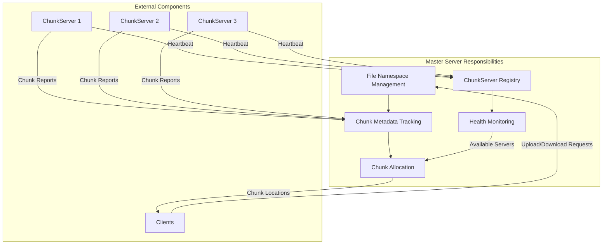

### Master Server's Role

| Responsibility | Description |
|----------------|-------------|
| **Metadata Storage** | Stores file-to-chunk mappings and chunk-to-server mappings |
| **Chunk Allocation** | Decides which chunk servers should store each chunk |
| **Health Monitoring** | Tracks which chunk servers are alive via heartbeats |
| **Coordination** | Tells clients where to read/write data |
| **No Data Storage** | Never handles actual file data (only metadata) |

---

## Data Structures

### Server Structure

```go
type Server struct {
    pb.UnimplementedMasterServer  // gRPC boilerplate
    metadata *Metadata             // All metadata storage
    address  string                // Server address (e.g., "localhost:8000")
}
```

**Purpose**: The main server struct that implements the gRPC Master service.

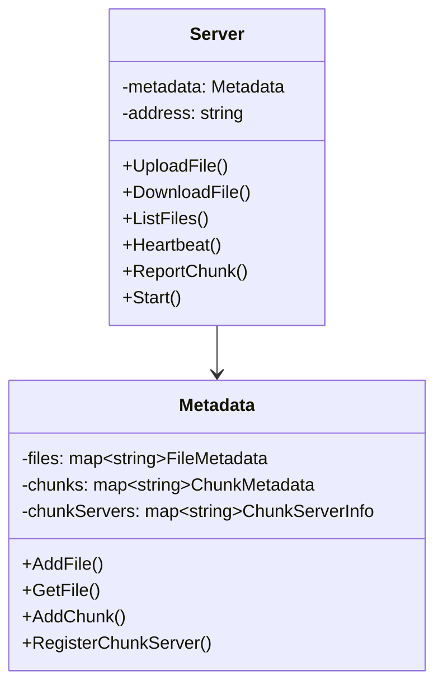

### Metadata Structure (from metadata.go)

The metadata manager stores three critical mappings:

```go
type Metadata struct {
    mu           sync.RWMutex                    // Thread safety lock
    files        map[string]*FileMetadata        // filename → file info
    chunks       map[string]*ChunkMetadata       // chunk handle → chunk info
    chunkServers map[string]*ChunkServerInfo     // address → server info
}
```

**Visual Representation:**

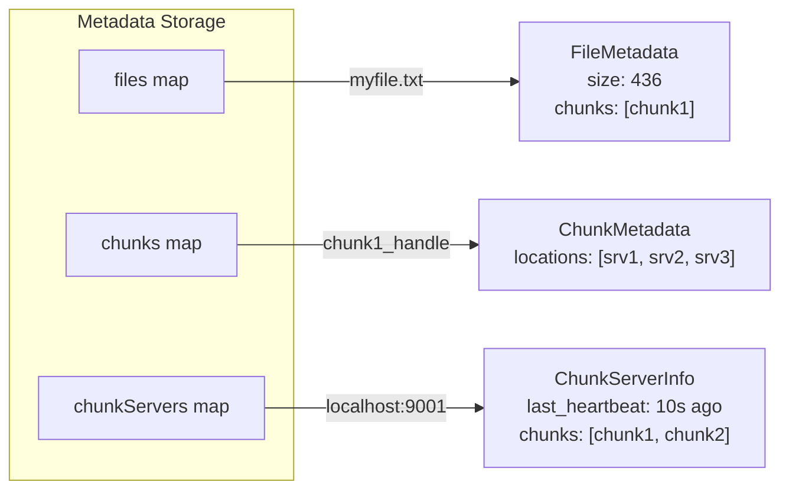

### FileMetadata

```go
type FileMetadata struct {
    Filename   string      // Original filename
    Filesize   int64       // Total file size in bytes
    ChunkCount int         // Number of chunks
    Chunks     []string    // List of chunk handles
    CreatedAt  time.Time   // Upload timestamp
}
```

**Example:**
```
Filename:   "mytest.txt"
Filesize:   436 bytes
ChunkCount: 1
Chunks:     ["2c12b35f740e1cbebac2aeb468bd427a"]
CreatedAt:  2025-11-26 00:28:06
```

### ChunkMetadata

```go
type ChunkMetadata struct {
    ChunkHandle string      // Unique chunk identifier
    Locations   []string    // Addresses of chunk servers storing this chunk
    Version     int32       // Chunk version (for consistency)
    Filename    string      // Parent file name
    ChunkIndex  int32       // Position in file (0, 1, 2, ...)
}
```

**Example:**
```
ChunkHandle: "2c12b35f740e1cbebac2aeb468bd427a"
Locations:   ["localhost:9001", "localhost:9002", "localhost:9003"]
Version:     1
Filename:    "mytest.txt"
ChunkIndex:  0
```

### ChunkServerInfo

```go
type ChunkServerInfo struct {
    Address       string      // Server address
    LastHeartbeat time.Time   // Last heartbeat received
    Chunks        []string    // Chunks stored on this server
}
```

**Example:**
```
Address:       "localhost:9001"
LastHeartbeat: 2025-11-26 00:28:15
Chunks:        ["2c12b35f740e1cbebac2aeb468bd427a", "abc123...", ...]
```

---

## Server Initialization

### Code Analysis

```go
func NewServer(address string) *Server {
    return &Server{
        metadata: NewMetadata(),
        address:  address,
    }
}
```

**What happens:**

1. Creates a new `Server` instance
2. Initializes `metadata` with empty maps
3. Sets the server address

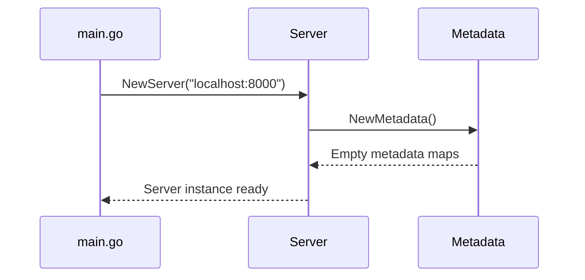

### Start Method

```go
func (s *Server) Start() error {
    lis, err := net.Listen("tcp", s.address)
    if err != nil {
        return fmt.Errorf("failed to listen: %v", err)
    }
    
    grpcServer := grpc.NewServer()
    pb.RegisterMasterServer(grpcServer, s)
    
    log.Printf("Master server starting on %s", s.address)
    
    if err := grpcServer.Serve(lis); err != nil {
        return fmt.Errorf("failed to serve: %v", err)
    }
    
    return nil
}
```

**Step-by-step:**

1. **`net.Listen("tcp", s.address)`** - Opens TCP socket on port 8000
2. **`grpc.NewServer()`** - Creates gRPC server instance
3. **`pb.RegisterMasterServer(grpcServer, s)`** - Registers our service handlers
4. **`grpcServer.Serve(lis)`** - Starts accepting connections (blocks forever)

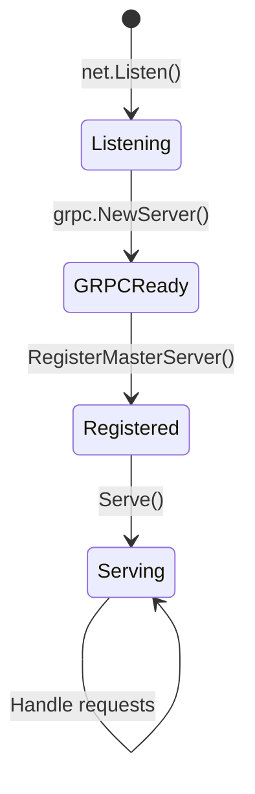

---

## File Upload Flow

### Complete Upload Sequence

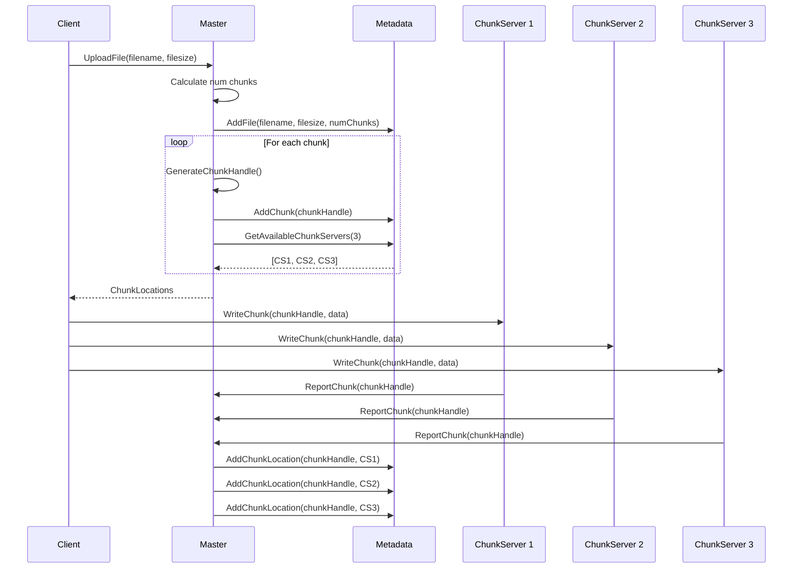

### UploadFile Method - Line by Line

```go
func (s *Server) UploadFile(ctx context.Context, req *pb.UploadFileRequest) (*pb.UploadFileResponse, error) {
```

**Parameters:**
- `ctx`: gRPC context (for timeouts, cancellation)
- `req`: Contains `Filename` and `Filesize`

**Returns:**
- `UploadFileResponse`: Contains chunk locations
- `error`: If something goes wrong

---

```go
    log.Printf("Upload request for file: %s, size: %d bytes", req.Filename, req.Filesize)
```

**Purpose:** Log the incoming request for debugging

---

```go
    numChunks := common.CalculateNumChunks(req.Filesize)
```

**Calculation Logic:**
```go
// From common/utils.go
func CalculateNumChunks(filesize int64) int {
    numChunks := filesize / ChunkSize  // ChunkSize = 64MB
    if filesize % ChunkSize != 0 {
        numChunks++  // Round up for partial chunk
    }
    return int(numChunks)
}
```

**Examples:**
- 436 bytes → 1 chunk
- 64MB → 1 chunk
- 64MB + 1 byte → 2 chunks
- 200MB → 4 chunks

---

```go
    s.metadata.AddFile(req.Filename, req.Filesize, numChunks)
```

**What this does:**
```go
// In metadata.go
func (m *Metadata) AddFile(filename string, filesize int64, chunkCount int) {
    m.mu.Lock()           // Acquire write lock
    defer m.mu.Unlock()   // Release lock when done
    
    m.files[filename] = &FileMetadata{
        Filename:   filename,
        Filesize:   filesize,
        ChunkCount: chunkCount,
        Chunks:     make([]string, 0, chunkCount),
        CreatedAt:  time.Now(),
    }
}
```

**State Change:**
```
Before: files = {}
After:  files = {
    "mytest.txt": {
        Filename: "mytest.txt",
        Filesize: 436,
        ChunkCount: 1,
        Chunks: [],
        CreatedAt: 2025-11-26 00:28:06
    }
}
```

---

```go
    chunkLocations := make([]*pb.ChunkLocation, 0, numChunks)
```

**Purpose:** Pre-allocate slice to store chunk location info for response

---

```go
    for i := 0; i < numChunks; i++ {
```

**Loop:** Process each chunk (for 436 bytes file, runs once)

---

```go
        chunkHandle := common.GenerateChunkHandle(req.Filename, i)
```

**Chunk Handle Generation:**
```go
// From common/utils.go
func GenerateChunkHandle(filename string, chunkIndex int) string {
    data := fmt.Sprintf("%s-%d", filename, chunkIndex)
    hash := sha256.Sum256([]byte(data))
    return fmt.Sprintf("%x", hash[:16])  // First 16 bytes as hex
}
```

**Example:**
```
Input:  filename="mytest.txt", chunkIndex=0
Data:   "mytest.txt-0"
SHA256: [compute hash]
Output: "2c12b35f740e1cbebac2aeb468bd427a"
```

---

```go
        s.metadata.AddChunk(chunkHandle, req.Filename, int32(i))
```

**Creates chunk metadata:**
```
chunks["2c12b35f740e1cbebac2aeb468bd427a"] = {
    ChunkHandle: "2c12b35f740e1cbebac2aeb468bd427a",
    Locations:   [],
    Version:     1,
    Filename:    "mytest.txt",
    ChunkIndex:  0
}
```

---

```go
        s.metadata.AddChunkToFile(req.Filename, chunkHandle)
```

**Updates file's chunk list:**
```
files["mytest.txt"].Chunks = ["2c12b35f740e1cbebac2aeb468bd427a"]
```

---

```go
        servers := s.metadata.GetAvailableChunkServers(common.ReplicationFactor)
```

**Server Selection Logic:**
```go
func (m *Metadata) GetAvailableChunkServers(count int) []string {
    m.mu.RLock()
    defer m.mu.RUnlock()
    
    servers := make([]string, 0, count)
    now := time.Now()
    
    for address, server := range m.chunkServers {
        // Check if heartbeat within last 30 seconds
        if now.Sub(server.LastHeartbeat) < 30*time.Second {
            servers = append(servers, address)
            if len(servers) >= count {
                break
            }
        }
    }
    
    return servers
}
```

**Returns:** `["localhost:9001", "localhost:9002", "localhost:9003"]`

**Health Check Diagram:**
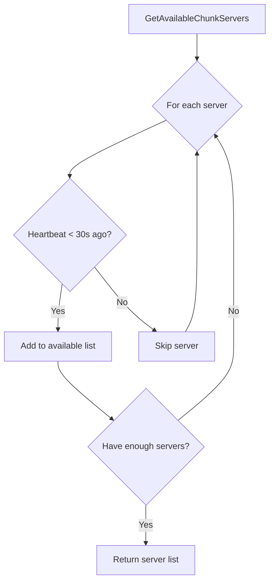

---

```go
        if len(servers) < common.ReplicationFactor {
            log.Printf("Warning: Only %d chunk servers available, need %d for replication", 
                len(servers), common.ReplicationFactor)
        }
```

**Warning:** If we can't get 3 servers, log a warning (but continue anyway)

---

```go
        chunkLocations = append(chunkLocations, &pb.ChunkLocation{
            ChunkHandle:          chunkHandle,
            ChunkServerAddresses: servers,
            ChunkIndex:           int32(i),
        })
```

**Builds response:**
```
chunkLocations = [{
    ChunkHandle: "2c12b35f740e1cbebac2aeb468bd427a",
    ChunkServerAddresses: ["localhost:9001", "localhost:9002", "localhost:9003"],
    ChunkIndex: 0
}]
```

---

```go
        log.Printf("Chunk %d (%s) assigned to servers: %v", i, chunkHandle, servers)
    }
```

**Logging:** Track chunk assignment

---

```go
    return &pb.UploadFileResponse{
        ChunkLocations: chunkLocations,
    }, nil
}
```

**Returns:** The chunk locations to the client

### Upload Flow Visualization

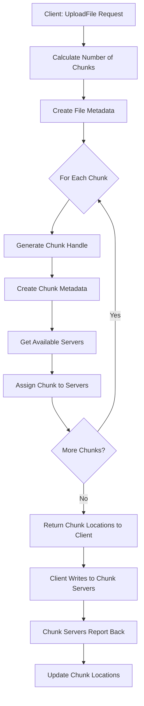

---

## File Download Flow

### Complete Download Sequence

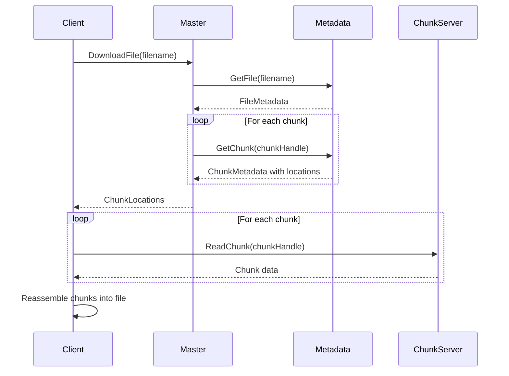

### DownloadFile Method - Line by Line

```go
func (s *Server) DownloadFile(ctx context.Context, req *pb.DownloadFileRequest) (*pb.DownloadFileResponse, error) {
    log.Printf("Download request for file: %s", req.Filename)
```

**Purpose:** Handle download request from client

---

```go
    file, exists := s.metadata.GetFile(req.Filename)
    if !exists {
        return nil, fmt.Errorf("file not found: %s", req.Filename)
    }
```

**Lookup Logic:**
```go
func (m *Metadata) GetFile(filename string) (*FileMetadata, bool) {
    m.mu.RLock()              // Read lock (allows concurrent reads)
    defer m.mu.RUnlock()
    
    file, exists := m.files[filename]
    return file, exists
}
```

**Error Handling:** If file doesn't exist, return error immediately

---

```go
    chunkLocations := make([]*pb.ChunkLocation, 0, len(file.Chunks))
```

**Pre-allocate:** Space for chunk location info

---

```go
    for i, chunkHandle := range file.Chunks {
```

**Iterate:** Through each chunk in the file

---

```go
        chunk, exists := s.metadata.GetChunk(chunkHandle)
        if !exists {
            return nil, fmt.Errorf("chunk not found: %s", chunkHandle)
        }
```

**Lookup chunk metadata:** Get server locations for this chunk

---

```go
        chunkLocations = append(chunkLocations, &pb.ChunkLocation{
            ChunkHandle:          chunkHandle,
            ChunkServerAddresses: chunk.Locations,
            ChunkIndex:           int32(i),
        })
    }
```

**Build response:** Include all chunk locations

---

```go
    return &pb.DownloadFileResponse{
        Filesize:       file.Filesize,
        ChunkLocations: chunkLocations,
    }, nil
}
```

**Return:** File size and where to get each chunk

### Download State Diagram

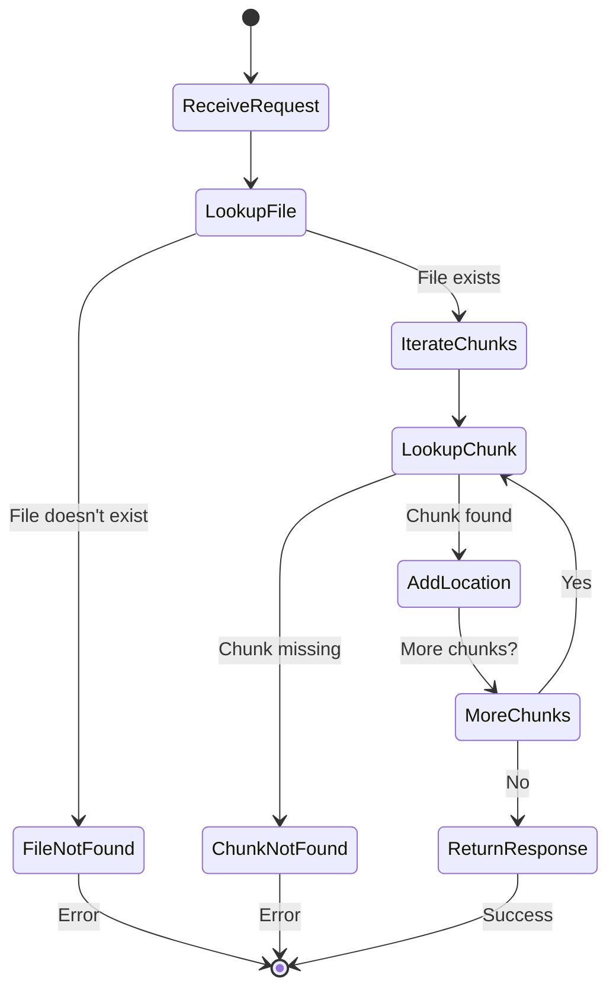

---

## Heartbeat Mechanism

### Purpose

Heartbeats allow the master to know which chunk servers are alive and what chunks they store.

### Heartbeat Flow

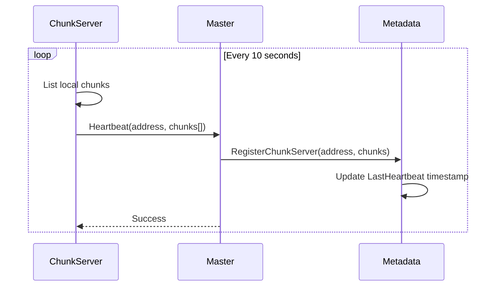

### Heartbeat Method - Line by Line

```go
func (s *Server) Heartbeat(ctx context.Context, req *pb.HeartbeatRequest) (*pb.HeartbeatResponse, error) {
    log.Printf("Heartbeat from chunk server: %s with %d chunks", 
        req.ChunkServerAddress, len(req.ChunkHandles))
```

**Log:** Track heartbeat activity

---

```go
    s.metadata.RegisterChunkServer(req.ChunkServerAddress, req.ChunkHandles)
```

**Registration Logic:**
```go
func (m *Metadata) RegisterChunkServer(address string, chunks []string) {
    m.mu.Lock()
    defer m.mu.Unlock()
    
    if server, exists := m.chunkServers[address]; exists {
        // Update existing server
        server.LastHeartbeat = time.Now()
        server.Chunks = chunks
    } else {
        // Register new server
        m.chunkServers[address] = &ChunkServerInfo{
            Address:       address,
            LastHeartbeat: time.Now(),
            Chunks:        chunks,
        }
    }
}
```

**State Update:**
```
Before: chunkServers["localhost:9001"] = {
    Address: "localhost:9001",
    LastHeartbeat: 2025-11-26 00:28:05,
    Chunks: ["chunk1"]
}

After: chunkServers["localhost:9001"] = {
    Address: "localhost:9001",
    LastHeartbeat: 2025-11-26 00:28:15,  ← Updated
    Chunks: ["chunk1", "chunk2"]          ← Updated
}
```

---

```go
    return &pb.HeartbeatResponse{
        Success: true,
    }, nil
}
```

**Acknowledge:** Heartbeat received successfully

### Health Monitoring Diagram

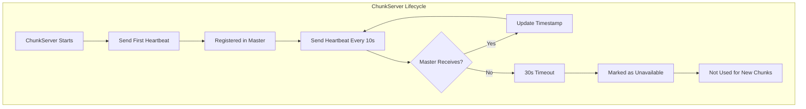

---

## Chunk Reporting

### When Chunks are Reported

After a client writes a chunk to a chunk server, the chunk server reports back to the master.

### Report Flow

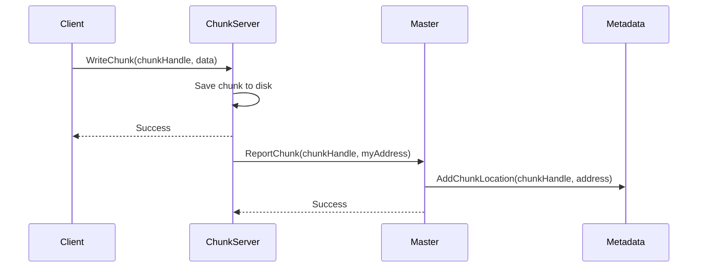

### ReportChunk Method - Line by Line

```go
func (s *Server) ReportChunk(ctx context.Context, req *pb.ReportChunkRequest) (*pb.ReportChunkResponse, error) {
    log.Printf("Chunk report: %s stored on %s", req.ChunkHandle, req.ChunkServerAddress)
```

**Log:** Track chunk storage completion

---

```go
    s.metadata.AddChunkLocation(req.ChunkHandle, req.ChunkServerAddress)
```

**Update Location:**
```go
func (m *Metadata) AddChunkLocation(chunkHandle string, serverAddress string) {
    m.mu.Lock()
    defer m.mu.Unlock()
    
    if chunk, exists := m.chunks[chunkHandle]; exists {
        // Avoid duplicates
        for _, loc := range chunk.Locations {
            if loc == serverAddress {
                return
            }
        }
        chunk.Locations = append(chunk.Locations, serverAddress)
    }
}
```

**State Change:**
```
Before: chunks["chunk1"].Locations = []
After:  chunks["chunk1"].Locations = ["localhost:9001"]

After 2nd report: chunks["chunk1"].Locations = ["localhost:9001", "localhost:9002"]
After 3rd report: chunks["chunk1"].Locations = ["localhost:9001", "localhost:9002", "localhost:9003"]
```

---

```go
    return &pb.ReportChunkResponse{
        Success: true,
    }, nil
}
```

**Acknowledge:** Chunk location recorded

---

## Complete Code Walkthrough

### Full server.go Structure

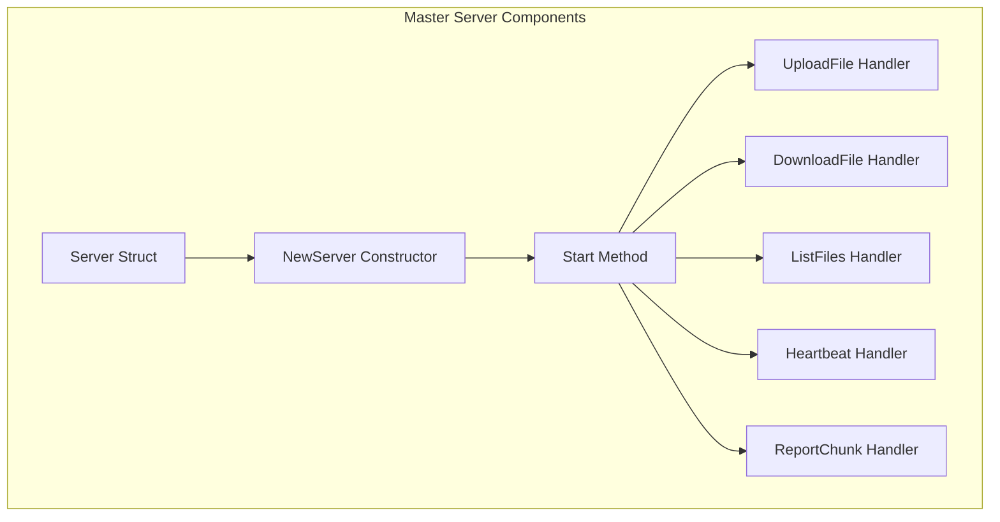

### ListFiles Method

```go
func (s *Server) ListFiles(ctx context.Context, req *pb.ListFilesRequest) (*pb.ListFilesResponse, error) {
    log.Printf("List files request")
    
    files := s.metadata.ListFiles()
    fileInfos := make([]*pb.FileInfo, 0, len(files))
    
    for _, file := range files {
        fileInfos = append(fileInfos, &pb.FileInfo{
            Filename:  file.Filename,
            Filesize:  file.Filesize,
            NumChunks: int32(file.ChunkCount),
        })
    }
    
    return &pb.ListFilesResponse{
        Files: fileInfos,
    }, nil
}
```

**Simple Flow:**
1. Get all files from metadata
2. Convert to protobuf format
3. Return list to client

---

## Key Design Principles

### 1. Separation of Concerns

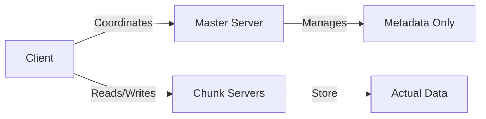

**Master never touches data** - Only coordinates operations

### 2. Thread Safety

All metadata operations use mutex locks:
```go
m.mu.Lock()         // Write operations
m.mu.RLock()        // Read operations
defer m.mu.Unlock() // Always unlock
```

### 3. Replication for Reliability

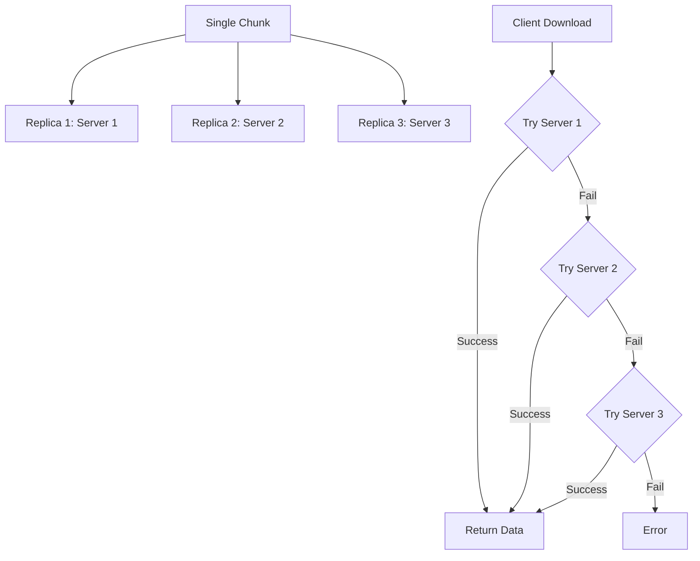

### 4. Stateless Client Protocol

Clients get chunk locations from master, then communicate directly with chunk servers:

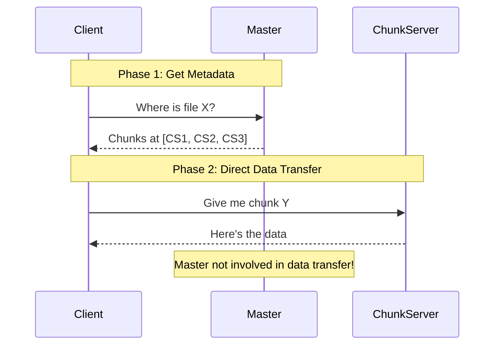

---

## Summary

The master server is elegantly simple yet powerful:

| Component | Responsibility |
|-----------|----------------|
| **Metadata** | Stores all file/chunk/server mappings |
| **UploadFile** | Allocates chunks and assigns servers |
| **DownloadFile** | Returns chunk locations |
| **Heartbeat** | Monitors chunk server health |
| **ReportChunk** | Updates chunk location info |

**Key Insight:** The master is a **coordinator**, not a data handler. It tells everyone where to go, but never touches the actual file data.

This design allows:
- ✅ Scalability (master handles only metadata)
- ✅ Performance (clients talk directly to chunk servers)
- ✅ Reliability (replication across multiple servers)
- ✅ Simplicity (clear separation of concerns)
